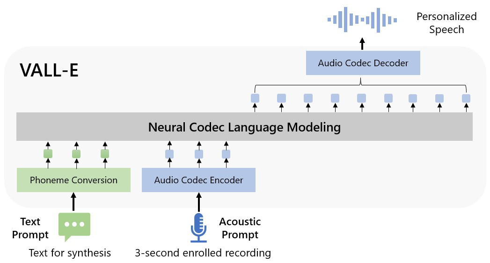
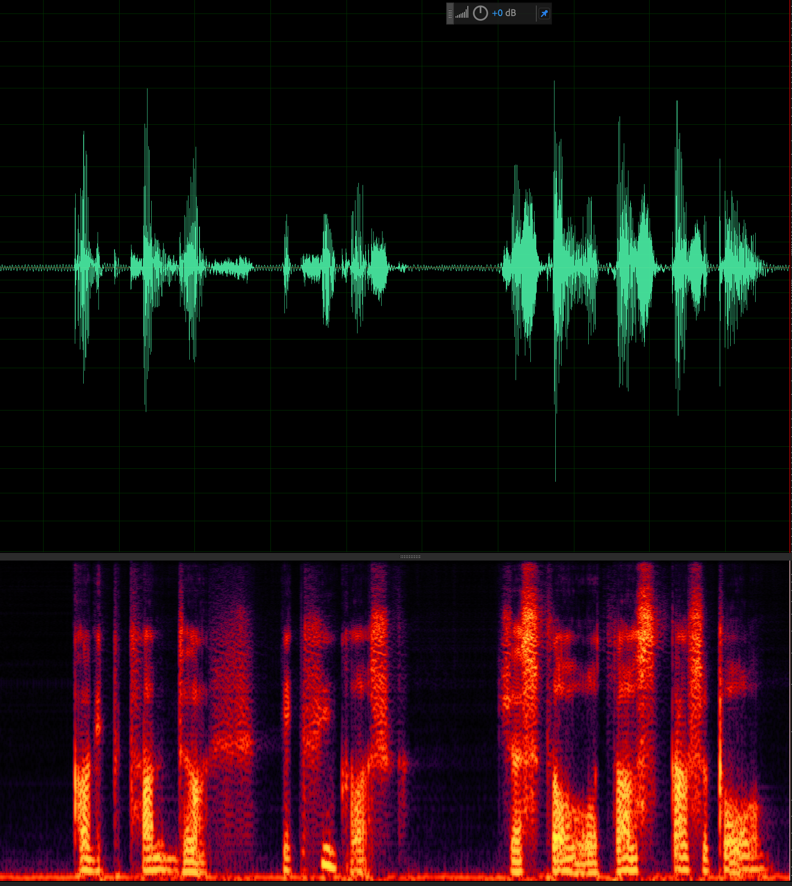

Language : 🇺🇸 | [🇨🇳](./README.zh-CN.md)

An unofficial PyTorch implementation of VALL-E([Neural Codec Language Models are Zero-Shot Text to Speech Synthesizers](https://arxiv.org/abs/2301.02111)).

We can train the VALL-E model on one GPU.



## Inference: In-Context Learning via Prompting
see [LibriTTS/Inference](https://github.com/lifeiteng/vall-e/blob/main/egs/libritts/README.md#inference)



## Demo

* [official demo](https://valle-demo.github.io/)

## Broader impacts

> Since VALL-E could synthesize speech that maintains speaker identity, it may carry potential risks in misuse of the model, such as spoofing voice identification or impersonating a specific speaker.

To avoid abuse, Well-trained models and services will not be provided.

## Progress

<a href="https://www.buymeacoffee.com/feiteng" target="_blank"></a>

- [x] Text and Audio Tokenizer
- [x] Dataset module and loaders
- [x] VALL-F: `seq-to-seq + PrefixLanguageModel`
    - [x] AR Decoder
    - [x] NonAR Decoder
- [x] VALL-E: `PrefixLanguageModel`
    - [x] AR Decoder
    - [x] NonAR Decoder
- [x] update README.zh-CN
- [x] Training
- [x] Inference: In-Context Learning via Prompting


## Installation

To get up and running quickly just follow the steps below:

```
# PyTorch
pip install torch==1.13.1 torchaudio==0.13.1 --extra-index-url https://download.pytorch.org/whl/cu116
pip install torchmetrics==0.11.1
# fbank
pip install librosa==0.8.1

# phonemizer
apt-get install espeak-ng
## OSX: brew install espeak
pip install phonemizer

# lhotse
# https://github.com/lhotse-speech/lhotse/pull/956
# https://github.com/lhotse-speech/lhotse/pull/960
pip uninstall lhotse
pip uninstall lhotse
pip install git+https://github.com/lhotse-speech/lhotse

# k2
# find the right version in https://huggingface.co/csukuangfj/k2
pip install https://huggingface.co/csukuangfj/k2/resolve/main/cuda/k2-1.23.4.dev20230224+cuda11.6.torch1.13.1-cp310-cp310-linux_x86_64.whl

# icefall
git clone https://github.com/k2-fsa/icefall
cd icefall
pip install -r requirements.txt
export PYTHONPATH=`pwd`/../icefall:$PYTHONPATH
echo "export PYTHONPATH=`pwd`/../icefall:\$PYTHONPATH" >> ~/.zshrc
echo "export PYTHONPATH=`pwd`/../icefall:\$PYTHONPATH" >> ~/.bashrc
cd -
source ~/.zshrc

# valle
git clone https://github.com/lifeiteng/valle.git
cd valle
pip install -e .
```


## Training
* [egs/libritts/README.md](egs/libritts/README.md)

#### Troubleshooting

* **SummaryWriter segmentation fault (core dumped)**
   * LINE `tb_writer = SummaryWriter(log_dir=f"{params.exp_dir}/tensorboard")`
   * FIX  [https://github.com/tensorflow/tensorboard/pull/6135/files](https://github.com/tensorflow/tensorboard/pull/6135/files)
   ```
   file=`python  -c 'import site; print(f"{site.getsitepackages()[0]}/tensorboard/summary/writer/event_file_writer.py")'`
   sed -i 's/import tf/import tensorflow_stub as tf/g' $file
   ```

## Contributing

* Parallelize bin/tokenizer.py on multi-GPUs
* <a href="https://www.buymeacoffee.com/feiteng" target="_blank"></a>


## Citing

To cite this repository:

```bibtex
@misc{valle,
  author={Feiteng Li},
  title={VALL-E: A neural codec language model},
  year={2023},
  url={http://github.com/lifeiteng/valle}
}
```

```bibtex
@article{VALL-E,
  title     = {Neural Codec Language Models are Zero-Shot Text to Speech Synthesizers},
  author    = {Chengyi Wang, Sanyuan Chen, Yu Wu,
               Ziqiang Zhang, Long Zhou, Shujie Liu,
               Zhuo Chen, Yanqing Liu, Huaming Wang,
               Jinyu Li, Lei He, Sheng Zhao, Furu Wei},
  year      = {2023},
  eprint    = {2301.02111},
  archivePrefix = {arXiv},
  volume    = {abs/2301.02111},
  url       = {http://arxiv.org/abs/2301.02111},
}
```
