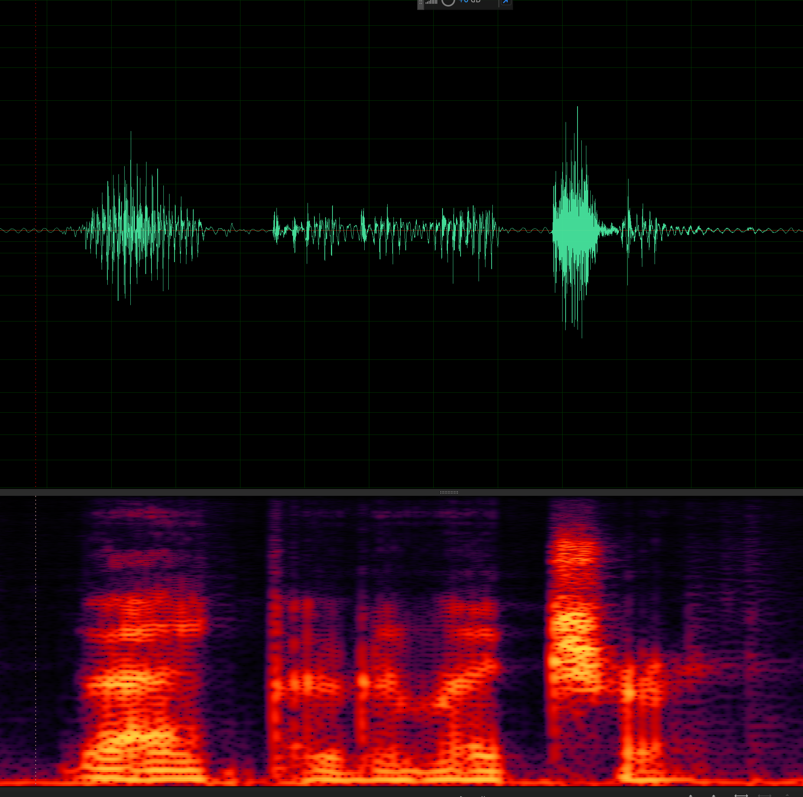

非官方 VALL-E（[Neural Codec Language Models are Zero-Shot Text to Speech Synthesizers](https://arxiv.org/abs/2301.02111)）开源 PyTorch 实现。

<a href="https://www.buymeacoffee.com/feiteng" target="_blank"></a>

## Inference: In-Context Learning via Prompting

**使用 nano 配置（比论文配置小 100 倍左右）训练的模型，已经能够合成类人的语音。**

```
cd egs/libritts

# VALL-E
# nano config is too small, so the AR-Decoder may not work well.
# re-run to get new(diverse) result.
python3 bin/infer.py \
    --decoder-dim 128 --nhead 4 --num-decoder-layers 4 --model-name valle \
    --text-prompts "Go to her." \
    --audio-prompts ./prompts/61_70970_000007_000001.wav \
    --text "To get up and running quickly just follow the steps below." \
    --output-dir infer/demo_valle_epoch20 \
    --checkpoint exp/valle_nano_v2/epoch-20.pt

# VALL-F
python3 bin/infer.py \
    --decoder-dim 128 --nhead 4 --num-decoder-layers 4 --model-name vallf \
    --text-prompts "Go to her." \
    --audio-prompts ./prompts/61_70970_000007_000001.wav \
    --text "To get up and running quickly just follow the steps below." \
    --output-dir infer/demo_vallf_epoch20 \
    --checkpoint exp/vallf_nano_v2/epoch-20.pt
```
###### VALL-E nano config epoch-20


###### VALL-F nano config epoch-10


## Demo

* [官方 demo](https://valle-demo.github.io/)

## 广泛影响

> Since VALL-E could synthesize speech that maintains speaker identity, it may carry potential risks in misuse of the model, such as spoofing voice identification or impersonating a specific speaker.

为避免滥用，良好的训练模型和服务不会被提供。

## 进展

<a href="https://www.buymeacoffee.com/feiteng" target="_blank"></a>

- [x] Text and Audio Tokenizer
- [x] Dataset module and loaders
- [x] VALL-F: `seq-to-seq + PrefixLanguageModel`
    - [x] AR Decoder
    - [x] NonAR Decoder
- [x] VALL-E: `PrefixLanguageModel`
    - [x] AR Decoder
    - [x] NonAR Decoder
- [x] update README.zh-CN
- [x] Training
- [x] Inference: In-Context Learning via Prompting
- [x] DeepSpeed: train large model on single GPU


## 安装


```
# PyTorch
pip install torch==1.13.1 torchaudio==0.13.1 --extra-index-url https://download.pytorch.org/whl/cu116

# DeepSpeed
sudo apt-get install -y libopenmpi-dev
pip install mpi4py
git clone https://github.com/microsoft/DeepSpeed.git
cd DeepSpeed
DS_BUILD_CPU_ADAM=1 pip install -e .

# phonemizer
apt-get install espeak-ng
## OSX: brew install espeak
pip install phonemizer

# lhotse
# https://github.com/lhotse-speech/lhotse/pull/956
# https://github.com/lhotse-speech/lhotse/pull/960
pip uninstall lhotse
pip uninstall lhotse
pip install git+https://github.com/lhotse-speech/lhotse

# k2 icefall
# pip install k2
git clone https://github.com/k2-fsa/k2.git
cd k2
export K2_MAKE_ARGS="-j12"
export K2_CMAKE_ARGS="-DK2_WITH_CUDA=OFF"
python setup.py install
cd -

git clone https://github.com/k2-fsa/icefall
cd icefall
pip install -r requirements.txt
export PYTHONPATH=`pwd`/../icefall:$PYTHONPATH
echo "export PYTHONPATH=`pwd`/../icefall:\$PYTHONPATH" >> ~/.zshrc
echo "export PYTHONPATH=`pwd`/../icefall:\$PYTHONPATH" >> ~/.bashrc
cd -

# valle
git clone https://github.com/lifeiteng/valle.git
cd valle
pip install -e .
```

## 训练
* [egs/libritts/README.md](egs/libritts/README.md)
#### Troubleshooting

* **SummaryWriter segmentation fault (core dumped)**
   * LINE `tb_writer = SummaryWriter(log_dir=f"{params.exp_dir}/tensorboard")`
   * FIX  [https://github.com/tensorflow/tensorboard/pull/6135/files](https://github.com/tensorflow/tensorboard/pull/6135/files)

## Contributing

* Multi-GPU Training
* Parallelize bin/tokenizer.py on multi-GPUs
* Provide GPU resources (MyEmail: `lifeiteng0422@163.com`)
* <a href="https://www.buymeacoffee.com/feiteng" target="_blank"></a>


## 引用

To cite this repository:

```bibtex
@misc{valle,
  author={Feiteng Li},
  title={VALL-E: A neural codec language model},
  year={2023},
  url={http://github.com/lifeiteng/valle}
}
```

```bibtex
@article{VALL-E,
  title     = {Neural Codec Language Models are Zero-Shot Text to Speech Synthesizers},
  author    = {Chengyi Wang, Sanyuan Chen, Yu Wu,
               Ziqiang Zhang, Long Zhou, Shujie Liu,
               Zhuo Chen, Yanqing Liu, Huaming Wang,
               Jinyu Li, Lei He, Sheng Zhao, Furu Wei},
  year      = {2023},
  eprint    = {2301.02111},
  archivePrefix = {arXiv},
  volume    = {abs/2301.02111},
  url       = {http://arxiv.org/abs/2301.02111},
}
```
