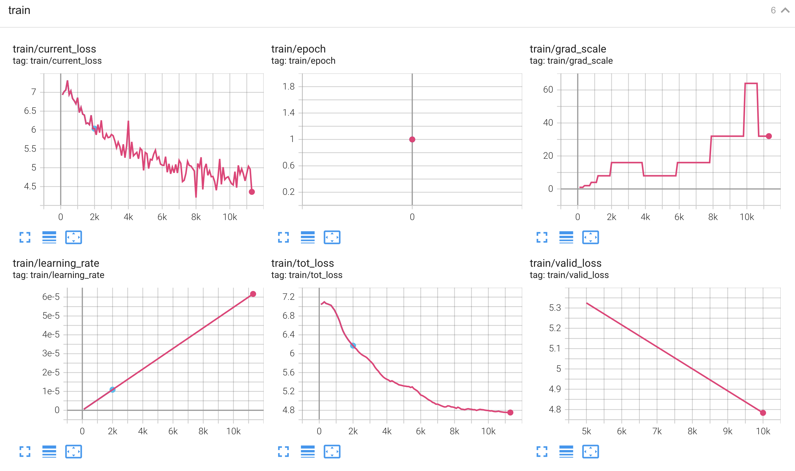

# LibriTTS

## Install deps
```
pip install librosa==0.8.1
```

## Prepare Dataset
```
cd egs/libritts

# Those stages are very time-consuming
bash prepare.sh --stage -1 --stop-stage 3
```
#### data

```
##  train
Cut statistics:
╒═══════════════════════════╤═══════════╕
│ Cuts count:               │ 354780    │
├───────────────────────────┼───────────┤
│ Total duration (hh:mm:ss) │ 555:09:48 │
├───────────────────────────┼───────────┤
│ mean                      │ 5.6       │
├───────────────────────────┼───────────┤
│ std                       │ 4.5       │
├───────────────────────────┼───────────┤
│ min                       │ 0.1       │
├───────────────────────────┼───────────┤
│ 25%                       │ 2.3       │
├───────────────────────────┼───────────┤
│ 50%                       │ 4.3       │
├───────────────────────────┼───────────┤
│ 75%                       │ 7.6       │
├───────────────────────────┼───────────┤
│ 80%                       │ 8.7       │
├───────────────────────────┼───────────┤
│ 85%                       │ 10.0      │
├───────────────────────────┼───────────┤
│ 90%                       │ 11.8      │
├───────────────────────────┼───────────┤
│ 95%                       │ 14.8      │
├───────────────────────────┼───────────┤
│ 99%                       │ 20.9      │
├───────────────────────────┼───────────┤
│ 99.5%                     │ 23.1      │
├───────────────────────────┼───────────┤
│ 99.9%                     │ 27.4      │
├───────────────────────────┼───────────┤
│ max                       │ 43.9      │
├───────────────────────────┼───────────┤
│ Recordings available:     │ 354780    │
├───────────────────────────┼───────────┤
│ Features available:       │ 354780    │
├───────────────────────────┼───────────┤
│ Supervisions available:   │ 354780    │
╘═══════════════════════════╧═══════════╛
SUPERVISION custom fields:
Speech duration statistics:
╒══════════════════════════════╤═══════════╤══════════════════════╕
│ Total speech duration        │ 555:09:48 │ 100.00% of recording │
├──────────────────────────────┼───────────┼──────────────────────┤
│ Total speaking time duration │ 555:09:48 │ 100.00% of recording │
├──────────────────────────────┼───────────┼──────────────────────┤
│ Total silence duration       │ 00:00:01  │ 0.00% of recording   │
╘══════════════════════════════╧═══════════╧══════════════════════╛
```


## Training
* Fix [segmentation fault (core dumped)](https://github.com/lifeiteng/vall-e#troubleshooting)
* Fix `h5py Unable to open object (object ...`
  * Make sure then version of h5py in `bin/tokenizer.py` and `bin/trainer.py` are same: `pip install h5py==3.8.0`

```
# You can try `--max-duration 400` on more powerful GPUs
python3 bin/trainer.py --max-duration 80 --filter-min-duration 0.5 --filter-max-duration 14 \
    --model-name "VALL-E" --norm-first true --add-prenet false --dtype "float32" \
    --decoder-dim 1024 --nhead 16 --num-decoder-layers 12 --prefix-mode 1 \
    --base-lr 0.05 --warmup-steps 200 --average-period 0 --accumulate-grad-steps 1 \
    --num-epochs 40 --start-epoch 1 --start-batch 0 \
    --exp-dir exp/valle
```


#### [demo](https://lifeiteng.github.io/valle/index.html)
 * [LibriTTS demo](https://lifeiteng.github.io/valle/index.html) Trained on one GPU with 24G memory
```
exp_dir=exp_0331/valle_Prefix1_Dim1024H16L12
python3 bin/trainer.py --max-duration 80 --filter-min-duration 0.5 --filter-max-duration 14 --train-stage 1 \
      --num-buckets 6 --dtype "bf16" --save-every-n 10000 \
      --model-name valle --share-embedding true --norm-first true --add-prenet false \
      --decoder-dim 1024 --nhead 16 --num-decoder-layers 12 --prefix-mode 1 \
      --base-lr 0.05 --warmup-steps 200 --average-period 0 \
      --num-epochs 20 --start-epoch 1 --start-batch 0 --accumulate-grad-steps 4 \
      --exp-dir ${exp_dir}

cp ${exp_dir}/best-valid-loss.pt ${exp_dir}/epoch-2.pt

python3 bin/trainer.py --max-duration 40 --filter-min-duration 0.5 --filter-max-duration 14 --train-stage 2 \
      --num-buckets 6 --dtype "float32" --save-every-n 10000 \
      --model-name valle --share-embedding true --norm-first true --add-prenet false \
      --decoder-dim 1024 --nhead 16 --num-decoder-layers 12 --prefix-mode 1 \
      --base-lr 0.05 --warmup-steps 200 --average-period 0 \
      --num-epochs 20 --start-epoch 3 --start-batch 0 --accumulate-grad-steps 4 \
      --exp-dir ${exp_dir}

# Inference
https://github.com/lifeiteng/lifeiteng.github.com/blob/main/valle/run.sh#L68
```

#### Prefix Mode 0 1 2 4 for NAR Decoder
**Paper Chapter 5.1** "The average length of the waveform in LibriLight is 60 seconds. During
training, we randomly crop the waveform to a random length between 10 seconds and 20 seconds. For the NAR acoustic prompt tokens, we select a random segment waveform of 3 seconds from the same utterance."
* **0**: no acoustic prompt tokens
* **1**: random prefix of current batched utterances **(This is recommended)**
* **2**: random segment of current batched utterances
* **4**: same as the paper (As they randomly crop the long waveform to multiple utterances, so the same utterance means pre or post utterance in the same long waveform.)

```
# If train AR & NAR Decoders with prefix_mode 4
python3 bin/trainer.py --prefix_mode 4 --dataset libritts --input-strategy PromptedPrecomputedFeatures ...
```

#### Train AR Decoder and NAR Decoder individually
* you can double `--max-duration` and try different `--prefix-mode 0|1|2|4`
```
# Train AR Decoder
exp_dir=exp/valle_stage1
python3 bin/trainer.py --train-stage 1 ... --num-epochs 20 --exp-dir ${exp_dir}

exp_dir=exp/valle_stage1
mkdir -p ${exp_dir}
cp exp/valle_stage1/best-valid-loss.pt ${exp_dir}/epoch-2.pt  # --start-epoch 3

# Train NAR Decoder
python3 bin/trainer.py --train-stage 2 ... --num-epochs 40 --start-epoch 3 --exp-dir ${exp_dir}
```

## Inference

```
python3 bin/infer.py --output-dir infer/demos \
    --model-name valle --norm-first true --add-prenet false \
    --decoder-dim 1024 --nhead 16 --num-decoder-layers 12 --prefix-mode 1 \
    --text-prompts "KNOT one point one five miles per hour." \
    --audio-prompts ./prompts/8463_294825_000043_000000.wav \
    --text "To get up and running quickly just follow the steps below." \
    --checkpoint=exp/valle/best-valid-loss.pt

```
